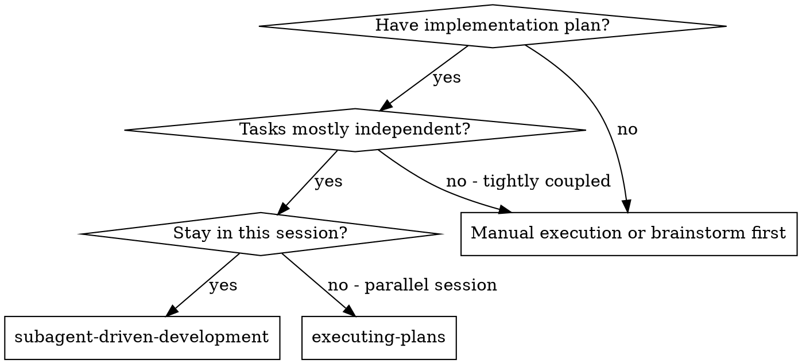
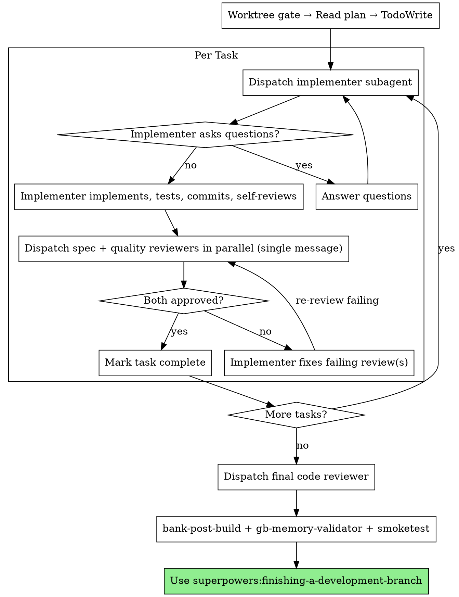

# Subagent-Driven Development

Execute plan by dispatching fresh subagent per task, with parallel review after each: spec compliance reviewer and code quality reviewer fired simultaneously in a single message.

**Core principle:** Fresh subagent per task + parallel two-reviewer dispatch (spec + quality simultaneously) = high quality, fast iteration

## HARD GATE: Worktree Required

Before reading the plan or dispatching any subagent, confirm you are in a git worktree:

```bash
git worktree list
git branch --show-current
pwd
```

Expected: current directory is under `.claude/worktrees/` and branch is a feature branch (not `master`).

If not in a worktree: use the `using-git-worktrees` skill or `EnterWorktree` tool before proceeding.

## When to Use



## The Process



## Parallel Reviewer Dispatch (mandatory)

After every implementer commit, dispatch spec-compliance reviewer AND code-quality reviewer as **two concurrent Agent calls in a single message** (see `dispatching-parallel-agents` skill).

- Wait for BOTH to return before acting
- If spec fails: implementer fixes spec gaps → re-dispatch spec reviewer alone
- If quality fails: implementer fixes quality issues → re-dispatch quality reviewer alone
- If both fail: implementer fixes both → re-dispatch both in a single message
- Both must pass before marking task complete
- **Never** run spec reviewer first and quality reviewer second in separate messages — fire them together

## Implementer Dispatch Instructions

When dispatching the implementer subagent, include ALL of the following in the prompt:

1. Full task text from the plan (do NOT make the subagent read the plan file)
2. Scene-setting context (where this task fits in the overall feature)
3. **Mandatory GB gate instructions:**

   > Before writing any `src/*.c` or `src/*.h` file:
   > 1. Invoke the `bank-pre-write` **skill** (HARD GATE — use the `Skill` tool) — verify bank-manifest.json entry exists
   > 2. Invoke the `gbdk-expert` **agent** (HARD GATE — use the `Agent` tool) — confirm API, data types, GBDK calls
   > Only write the C file AFTER both gates pass.
   >
   > After any successful build:
   > 1. Invoke the `bank-post-build` skill (HARD GATE) — verify bank placements and budgets
   > 2. Run `make memory-check` via the `gb-memory-validator` **skill** (HARD GATE) — if any budget is FAIL or ERROR, stop and fix
   >
   > Follow TDD: write failing test first, make it pass, then build.

## Parallel Implementer Batches

When the plan flags tasks as **parallelizable** (different output files, no shared state), dispatch 2–3 implementer agents in a single message instead of sequentially.

See `dispatching-parallel-agents` skill for full rules. Summary:
1. Dispatch 2–3 implementers in one message (each writing different files, no shared git commits)
2. Wait for ALL to complete and commit
3. Dispatch spec + quality reviewers for the batch in a single parallel message
4. Any failures → targeted fix → re-review
5. All pass → mark batch complete, continue to next batch or final review

**Batch size limit:** Max 3 concurrent implementers.

**Red flag:** Do NOT parallelize tasks that share an output file or commit to the same branch simultaneously.

## Post-Build Review Step

After all tasks are complete and the final code reviewer approves, run the post-build review:

1. Run `make test` — if any tests fail, stop and fix before continuing
2. Invoke `bank-post-build` skill — if FAIL, stop and fix
3. Run smoketest sequence:
   ```bash
   # From the worktree directory
   git fetch origin && git merge origin/master
   # Always clean build before memory validator + smoketest
   make clean && GBDK_HOME=/home/mathdaman/gbdk make
   ```
4. Run `make memory-check` (gb-memory-validator skill) — if any budget is FAIL or ERROR, stop and fix
5. Launch:
   ```bash
   java -jar /home/mathdaman/.local/share/emulicious/Emulicious.jar build/nuke-raider.gb
   ```
   Tell the user it's running. Wait for their confirmation before proceeding.

Only after smoketest confirmed: use `superpowers:finishing-a-development-branch`.

## Final Code Reviewer Dispatch

After all tasks complete, dispatch a final code quality reviewer with the full feature branch diff:

- Use `superpowers:requesting-code-review` as the reviewer prompt template
- Scope: the entire feature branch (`git diff master...HEAD`), not just the last task
- The reviewer should confirm all requirements are met and the implementation is ready to merge
- Only proceed to the Post-Build Review Step after the final reviewer approves

## Example Workflow

```
[Worktree gate confirmed]
[Read plan: docs/plans/feature-plan.md]
[Extract all 5 tasks with full text and context]
[Create TodoWrite with all tasks]

Task 1: Add foo module

[Dispatch implementer with: task text + context + GB gate instructions]

Implementer: "Before I begin — should foo_init() take a config struct?"

You: "No config needed, just init to defaults"

Implementer: [Follows TDD, invokes bank-pre-write, gbdk-expert, writes C, runs tests,
              builds ROM, invokes bank-post-build, commits]

[Dispatch spec reviewer]
Spec reviewer: ✅ Spec compliant

[Dispatch code quality reviewer]
Code reviewer: ✅ Approved

[Mark Task 1 complete]

...

[After all tasks]
[Dispatch final code-reviewer]
Final reviewer: All requirements met

[Run bank-post-build + gb-memory-validator]
[Run smoketest → user confirms]
[Use finishing-a-development-branch]
```

## Red Flags

**Never:**
- Start implementation on main/master branch
- Skip worktree gate
- Skip reviews (spec compliance OR code quality)
- Proceed with unfixed issues
- Dispatch multiple implementation subagents in parallel when they share an output file or will commit to the branch simultaneously (race condition) — parallelizing tasks that write different files IS allowed (see dispatching-parallel-agents)
- Run spec and quality reviewers sequentially when they can fire in a single parallel message (always fire them together)
- Miss dispatching-parallel-agents skill before deciding on agent dispatch strategy
- Make subagent read plan file (provide full text instead)
- Skip scene-setting context (subagent needs to understand where task fits)
- Ignore subagent questions (answer before letting them proceed)
- Accept "close enough" on spec compliance
- Skip review loops (reviewer found issues = implementer fixes = review again)
- Start code quality review before spec compliance is ✅
- Move to next task while either review has open issues
- Skip bank-pre-write or gbdk-expert before any C write
- Skip bank-post-build or gb-memory-validator in post-build review
- Launch smoketest from main repo's build/ (use worktree's build/)

## Integration

**Required workflow skills:**
- **superpowers:using-git-worktrees** — REQUIRED: set up isolated workspace before starting
- **superpowers:writing-plans** — creates the plan this skill executes
- **superpowers:requesting-code-review** — code review template for reviewer subagents
- **superpowers:finishing-a-development-branch** — complete development after all tasks
- **dispatching-parallel-agents** — REQUIRED: consult before any agent dispatch decision (offload table, parallelize rules, reviewer pattern)

**Subagents should use:**
- **superpowers:test-driven-development** — subagents follow TDD for each task
- **bank-pre-write** — before every C write
- **gbdk-expert** — before every C write
- **bank-post-build** — after every build

**Alternative workflow:**
- **superpowers:executing-plans** — use for parallel session instead of same-session execution
