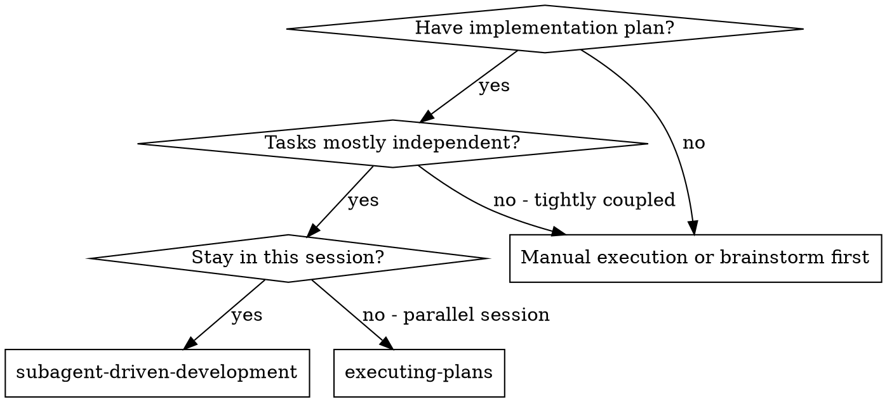
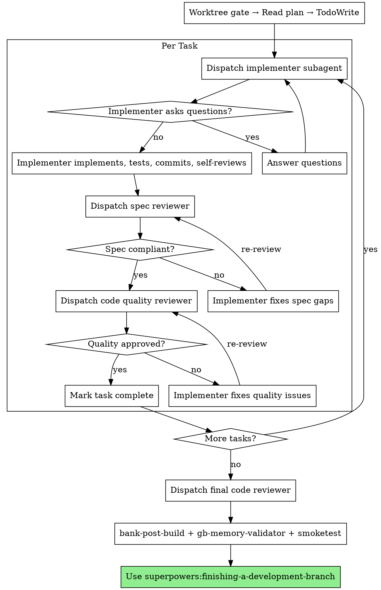

# Subagent-Driven Development

Execute plan by dispatching fresh subagent per task, with two-stage review after each: spec compliance review first, then code quality review.

**Core principle:** Fresh subagent per task + two-stage review (spec then quality) = high quality, fast iteration

## HARD GATE: Worktree Required

Before reading the plan or dispatching any subagent, confirm you are in a git worktree:

```bash
git worktree list
git branch --show-current
pwd
```

Expected: current directory is under `.claude/worktrees/` and branch is a feature branch (not `master`).

If not in a worktree: use the `using-git-worktrees` skill or `EnterWorktree` tool before proceeding.

## When to Use



## The Process



## Implementer Dispatch Instructions

When dispatching the implementer subagent, include ALL of the following in the prompt:

1. Full task text from the plan (do NOT make the subagent read the plan file)
2. Scene-setting context (where this task fits in the overall feature)
3. **Mandatory GB gate instructions:**

   > Before writing any `src/*.c` or `src/*.h` file:
   > 1. Invoke the `bank-pre-write` skill (HARD GATE) — verify bank-manifest.json entry exists
   > 2. Invoke the `gbdk-expert` agent (HARD GATE) — confirm API, data types, GBDK calls
   > Only write the C file AFTER both gates pass.
   >
   > After any successful build:
   > 1. Invoke the `bank-post-build` skill (HARD GATE) — verify bank placements and budgets
   >
   > Follow TDD: write failing test first, make it pass, then build.

## Post-Build Review Step

After all tasks are complete and the final code reviewer approves, run the post-build review:

1. Invoke `bank-post-build` skill — if FAIL, stop and fix
2. Run `gb-memory-validator` agent — if any budget is FAIL, stop and fix
3. Run smoketest sequence:
   ```bash
   # From the worktree directory
   git fetch origin && git merge origin/master
   GBDK_HOME=/home/mathdaman/gbdk make
   java -jar /home/mathdaman/.local/share/emulicious/Emulicious.jar build/nuke-raider.gb
   ```
   Tell the user it's running. Wait for their confirmation before proceeding.

Only after smoketest confirmed: use `superpowers:finishing-a-development-branch`.

## Example Workflow

```
[Worktree gate confirmed]
[Read plan: docs/plans/feature-plan.md]
[Extract all 5 tasks with full text and context]
[Create TodoWrite with all tasks]

Task 1: Add foo module

[Dispatch implementer with: task text + context + GB gate instructions]

Implementer: "Before I begin — should foo_init() take a config struct?"

You: "No config needed, just init to defaults"

Implementer: [Follows TDD, invokes bank-pre-write, gbdk-expert, writes C, runs tests,
              builds ROM, invokes bank-post-build, commits]

[Dispatch spec reviewer]
Spec reviewer: ✅ Spec compliant

[Dispatch code quality reviewer]
Code reviewer: ✅ Approved

[Mark Task 1 complete]

...

[After all tasks]
[Dispatch final code-reviewer]
Final reviewer: All requirements met

[Run bank-post-build + gb-memory-validator]
[Run smoketest → user confirms]
[Use finishing-a-development-branch]
```

## Red Flags

**Never:**
- Start implementation on main/master branch
- Skip worktree gate
- Skip reviews (spec compliance OR code quality)
- Proceed with unfixed issues
- Dispatch multiple implementation subagents in parallel (conflicts)
- Make subagent read plan file (provide full text instead)
- Skip scene-setting context (subagent needs to understand where task fits)
- Ignore subagent questions (answer before letting them proceed)
- Accept "close enough" on spec compliance
- Skip review loops (reviewer found issues = implementer fixes = review again)
- Start code quality review before spec compliance is ✅
- Move to next task while either review has open issues
- Skip bank-pre-write or gbdk-expert before any C write
- Skip bank-post-build or gb-memory-validator in post-build review
- Launch smoketest from main repo's build/ (use worktree's build/)

## Integration

**Required workflow skills:**
- **superpowers:using-git-worktrees** — REQUIRED: set up isolated workspace before starting
- **superpowers:writing-plans** — creates the plan this skill executes
- **superpowers:requesting-code-review** — code review template for reviewer subagents
- **superpowers:finishing-a-development-branch** — complete development after all tasks

**Subagents should use:**
- **superpowers:test-driven-development** — subagents follow TDD for each task
- **bank-pre-write** — before every C write
- **gbdk-expert** — before every C write
- **bank-post-build** — after every build

**Alternative workflow:**
- **superpowers:executing-plans** — use for parallel session instead of same-session execution
